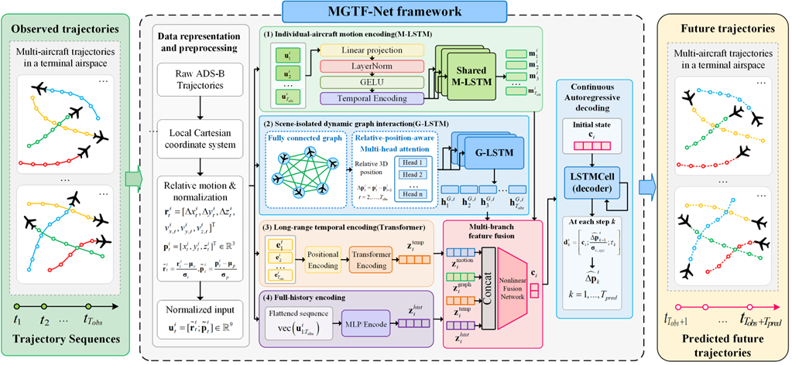

# MGTF-Net

Official minimal implementation of MGTF-Net for multi-aircraft trajectory prediction.

## Overview

This package preserves the formal ungated main model: 9D input projection, shared motion LSTM, scene-isolated fully connected multi-head GATv2 with relative 3D edges and self edges, graph LSTM, temporal Transformer, full-history encoder, four-branch fusion, continuous autoregressive decoding, and multi-horizon position-based loss.

## Framework



MGTF-Net framework overview. Trajectory illustrations are schematic; this figure does not distribute the proprietary trajectory datasets.

## Included

- MGTF-Net model architecture and training loss
- Training and inference execution demos
- Six evaluation metrics in meters
- Artificial Cartesian synthetic data and its standalone generator
- MGTF-Net framework figure

## Not included

The proprietary ADS-B datasets used in the paper cannot be publicly released due to data-use and confidentiality restrictions.

Ablation-study implementations and internal diagnostic scripts are not included because this repository focuses on the reproducible implementation of the proposed main model.

No proprietary checkpoints, experimental results, data caches, or geographic data parsers are distributed.

## Synthetic data statement

The included synthetic data are artificially generated solely for demonstrating the code interface and execution pipeline. They are not derived from, reconstructed from, or representative samples of the proprietary ADS-B datasets used in the paper.

The generator uses random local Cartesian positions and straight, gently turning, climbing, and descending kinematics. Scene indices are artificial integers, not flight identifiers. Demo metrics must not be interpreted as paper results or evidence of inter-aircraft interaction benefits.

## Quick start

Use Python 3.10 or newer in a clean environment:

```bash
pip install -r requirements.txt
python train_demo.py --epochs 3
python inference_demo.py
```

Both demos run on CPU, use seed 2022, and need only NumPy and PyTorch. Training defaults to three epochs rather than the 300-epoch reference budget. The best validation demo checkpoint is saved locally in `artifacts/demo_checkpoint.pt` and excluded from version control. Without that checkpoint, inference explicitly uses random weights. Regenerate the bundled artificial example with `python -m data.synthetic_dataset`.

## Data format and units

```python
observed_features  # [N, 12, 9]
future_positions  # [N, 20, 3]
scene_ids         # [N], contiguous aircraft groups within each scene
```

Sampling interval is 5 seconds. The nine public feature channels are `[delta_x, delta_y, delta_z, vx, vy, vz, x, y, z]`: displacements and positions are in meters; absolute velocities are in meters per second. The first observed displacement is zero. Velocity channels are absolute velocities, not velocity differences. If velocities are unavailable, the generic helper estimates them from observed finite differences only.

`MGTFNet.predict_positions(observed_features, scene_ids)` returns `[N,20,3]` positions in meters. The core `forward` interface preserves time-first inputs and the original numerical convention: the six motion channels and three position channels are divided by 1000 before normalization; coordinates/displacements use km, velocities use km/s. Only training observations fit normalization statistics. Relative-position graph edges use normalized position differences, exactly as in the formal implementation; they are not physical-distance filtering rules. Graphs remain fully connected within each scene and include self edges.

Native output is `[20,N,6]`: first three channels are predicted displacement increments; remaining observed auxiliary channels are carried forward and not scored. Integrating increments from the final observation produces position predictions. The decoder retains the last-four-observation displacement trend plus learned correction. No future input, sparse-neighbor filter, adaptive gate, or graph-specific dropout is introduced.

## Model and loss

See `config.py` for formal dimensions and optimizer settings. Default model parameter count is **234,691**. Each graph head has dimension 16; Transformer has two layers, four heads, and feed-forward dimension 128. Fusion is 256 → 128 → 64 and the AR LSTMCell is 68 → 64.

The formal native-km training objective averages `(ADE_h + 0.5 * FDE_h) * (100 / h)` over horizons 40, 60, 80, and 100 seconds. It retains the original square-root stabilizer `1e-8`. Demo loss therefore is not an ADE reported in meters. Public evaluation functions report Euclidean 3D and horizontal ADE/FDE, mean absolute vertical error, and final absolute vertical error, all in meters.

## Reproducibility scope

This is a minimal reproducible **implementation and execution pipeline**, not a reproduction of confidential-data benchmark scores. The release audit records architecture parity, privacy checks, and CPU demo verification. Cross-platform numerical reproducibility is not guaranteed. Verified runtime versions are listed in `CODE_RELEASE_AUDIT.md`.
